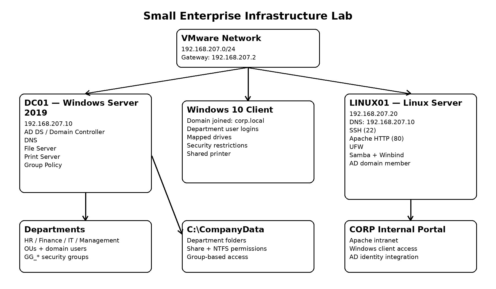
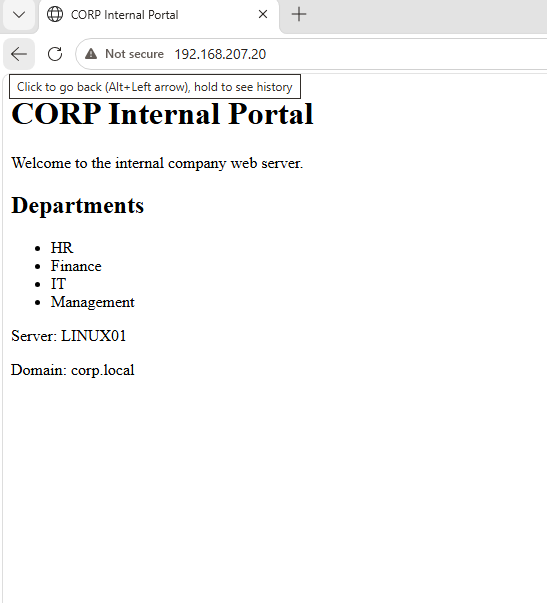
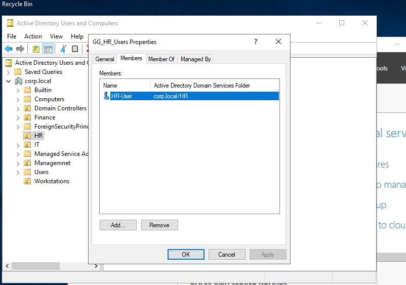
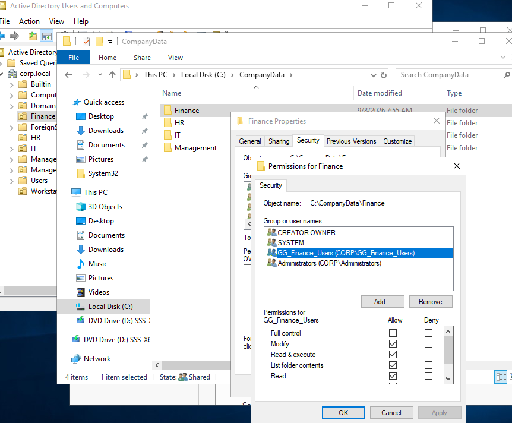
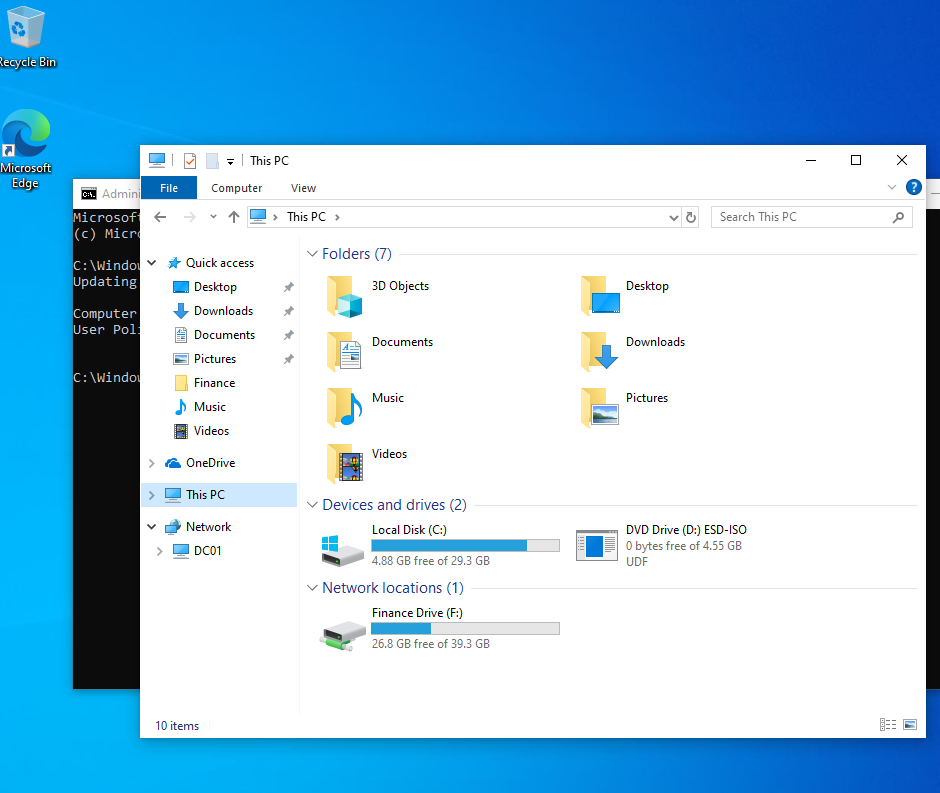
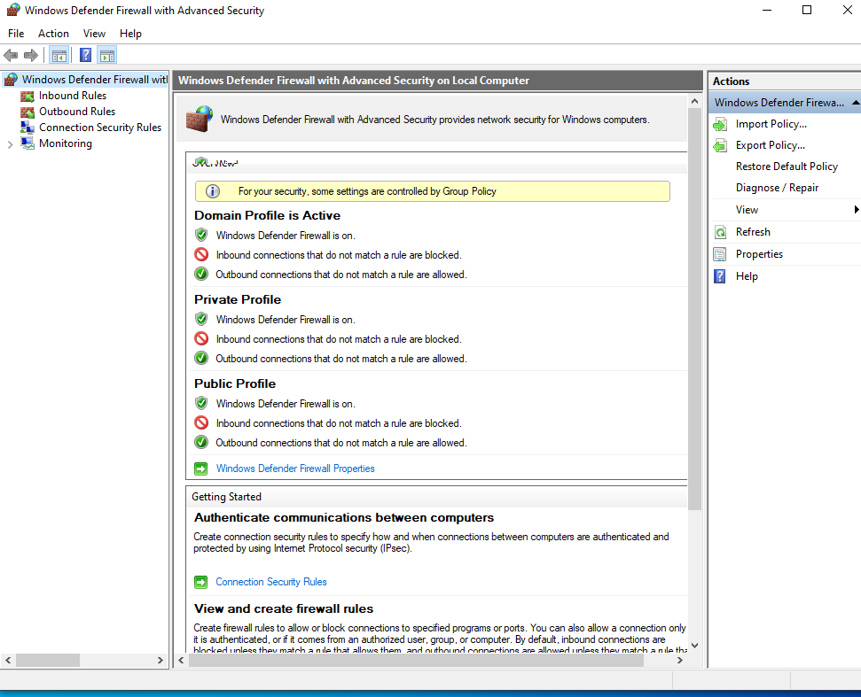
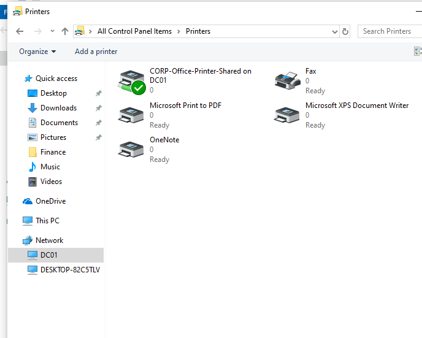
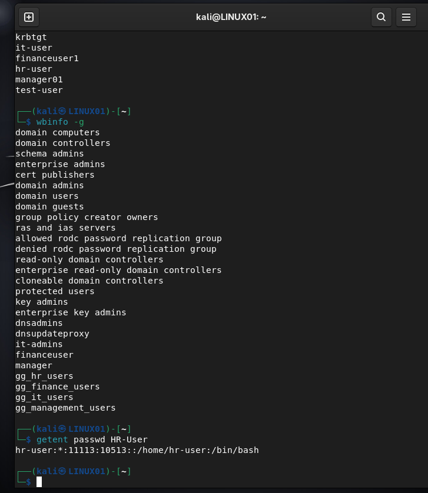

# Small Enterprise Infrastructure Lab

A hands-on enterprise infrastructure lab built with **Windows Server 2019, Windows 10, and Linux**, focused on Active Directory, DNS, Group Policy, file services, printer deployment, endpoint firewall policy, and Windows/Linux integration.

> **Status:** Core technical build and final validation completed.

## Project Objective

The goal of this project was to simulate a small-company infrastructure and learn how the major services work together rather than configuring each topic in isolation.

The lab demonstrates:

- Centralized identity with Active Directory Domain Services (AD DS)
- Active Directory-integrated DNS
- Departmental OUs, users, and security groups
- Windows 10 domain membership and domain authentication
- Centralized file sharing with Share + NTFS permissions
- Department isolation and inheritance troubleshooting
- Group Policy for password/account lockout, user restrictions, mapped drives, and workstation firewall settings
- Centralized printer sharing and deployment troubleshooting
- Linux static networking, SSH, Apache intranet, and UFW
- Linux membership in the Windows AD domain using Kerberos, Samba, and Winbind
- Final end-to-end validation and troubleshooting documentation

## Architecture



### Core Systems

| System | Role | Address |
|---|---|---|
| `DC01` | Windows Server 2019 — AD DS, DNS, File Server, Print Server, Group Policy | `192.168.207.10/24` |
| Windows 10 Client | Domain workstation | DHCP address on `192.168.207.0/24` |
| `LINUX01` | Linux server — SSH, Apache, UFW, Samba/Winbind AD member | `192.168.207.20/24` |
| VMware Gateway | Virtual network gateway | `192.168.207.2` |

Domain:

```text
corp.local
```

NetBIOS name:

```text
CORP
```

## Active Directory Structure

```text
corp.local
├── HR
├── Finance
├── IT
├── Management
└── Workstations
```

Department security groups:

```text
GG_HR_Users
GG_Finance_Users
GG_IT_Users
GG_Management_Users
```

The final access model was:

```text
User -> Department Security Group -> NTFS Permission
```

This is cleaner and more scalable than assigning folder permissions directly to every user.

## File Server Design

Server path:

```text
C:\CompanyData
├── HR
├── Finance
├── IT
└── Management
```

Network path:

```text
\\DC01\CompanyData
```

### Permission Design

The project intentionally separated the concepts of:

```text
Share Permission = network access gate
NTFS Permission  = file/folder rights
Inheritance      = parent NTFS permissions flowing to child objects
OU               = AD organization and GPO targeting
```

Department groups received **Modify** on their own folders. Broad inherited access was removed so other departments were denied.

## Group Policy Implemented

### Password and Account Lockout

Lab settings included:

- Minimum password length: 8 characters
- Password complexity: Enabled
- Minimum password age: 30 days
- Maximum password age: 90 days
- Lockout threshold: 5 failed attempts
- Lockout duration: 15 minutes
- Reset counter: 15 minutes

The lockout was tested with a dedicated `test-user`, then unlocked through Active Directory Users and Computers.

### User Security Restrictions

Normal domain users were restricted from:

- Command Prompt
- Control Panel
- Windows Settings
- Removable storage access was configured but not physically tested because a USB device was unavailable

### Workstation Firewall

A computer GPO linked to the `Workstations` OU configured Windows Defender Firewall:

```text
Firewall state: On
Inbound unmatched connections: Block
Outbound unmatched connections: Allow
```

### Mapped Drives

| Department | Drive | Path |
|---|---|---|
| HR | `H:` | `\\DC01\CompanyData\HR` |
| Finance | `F:` | `\\DC01\CompanyData\Finance` |
| IT | `I:` | `\\DC01\CompanyData\IT` |
| Management | `M:` | `\\DC01\CompanyData\Management` |

Mapped drives were deployed with Group Policy Preferences.

## Print Services

The **Print Server** role was installed on `DC01`.

A lab printer was created and shared as:

```text
\\DC01\CORP-Office-Printer-Shared
```

The first attempt used Microsoft Print to PDF, which could not be shared. The lab was corrected to use **Generic / Text Only**.

Printer deployment initially produced a **Deployed Printer Connections** warning. The legacy deployment was removed and replaced with a **Group Policy Preferences Shared Printer** item using `Update` action.

## Linux Integration

`LINUX01` was configured with:

```text
IP:      192.168.207.20/24
Gateway: 192.168.207.2
DNS:     192.168.207.10
```

### Services

- OpenSSH Server — TCP 22
- Apache HTTP Server — TCP 80
- UFW firewall
- Samba + Winbind domain membership
- Kerberos authentication

Windows 10 successfully connected to Linux over SSH, and the Apache intranet was reachable from the Windows client.

### Internal Intranet



The site was hosted from:

```text
/var/www/html/index.html
```

### Active Directory Integration

SSSD was originally planned, but the Kali package environment did not expose the required SSSD packages. Rather than mixing incompatible repositories, the project used **Samba + Winbind**.

The Linux machine successfully joined AD:

```bash
sudo net ads testjoin
```

Result:

```text
Join is OK
```

AD users and groups were visible through Winbind/NSS using commands such as:

```bash
wbinfo -u
wbinfo -g
getent passwd HR-User
```

## Linux Firewall

UFW policy:

```text
Default incoming: deny
Default outgoing: allow
22/tcp: allow
80/tcp: allow
```

## Key Troubleshooting Examples

The project included several real troubleshooting cases:

1. **NTFS Modify but user could not write** — Share permission was only Read.
2. **HR could access Finance/Management** — inherited broad NTFS permissions were too permissive.
3. **Microsoft Print to PDF could not be shared** — replaced with Generic / Text Only.
4. **Printer GPO generated warnings** — removed legacy deployment and used GPP Shared Printer.
5. **Linux could resolve internal AD DNS but not internet names** — configured DNS forwarders on DC01.
6. **SSSD packages unavailable on Kali** — used Samba/Winbind instead of forcing foreign repositories.
7. **`wbinfo -t` failed without elevation** — verified the join/service/socket, then `sudo wbinfo -t` succeeded.
8. **Linux protected directory denied the `kali` user** — expected behavior because only the `webadmins` group had access.

Full troubleshooting notes are in [docs/TROUBLESHOOTING.md](docs/TROUBLESHOOTING.md).

## Selected Evidence

### Department security group membership



### NTFS group-based permission



### Finance mapped drive



### Windows Firewall controlled by GPO



### Shared printer



### Linux Active Directory identity lookup



## Final Validation

The final validation confirmed:

- AD DS / DNS health
- Windows domain login
- Department isolation
- Security-group-based permissions
- Department mapped drives
- User security restriction GPO
- Account lockout and unlock
- Workstation firewall GPO
- Shared printer presence
- Linux static networking and DNS
- SSH and Apache services
- Linux UFW policy
- Linux AD trust and AD identity lookup
- Linux local group permissions

See [docs/VALIDATION.md](docs/VALIDATION.md) for the complete validation checklist.

## Documentation

- [Full Project Walkthrough](docs/PROJECT_WALKTHROUGH.md)
- [Troubleshooting Log](docs/TROUBLESHOOTING.md)
- [Validation Results](docs/VALIDATION.md)
- [Command Reference](docs/COMMAND_REFERENCE.md)

## Configuration Samples

- [Samba domain-member configuration](configs/smb.conf)
- [Internal portal HTML](configs/intranet-index.html)
- [Linux UFW rules](configs/linux-firewall-rules.txt)
- [Linux static network commands](configs/networkmanager-static-ip.txt)

## What I Would Improve Next

For a future version of the lab, I would add improvements gradually rather than making the initial project unnecessarily large:

- Second Domain Controller for redundancy
- DHCP
- Backups and restore testing
- File quotas / auditing
- HTTPS and certificates for the intranet
- Centralized monitoring
- PowerShell or Ansible automation
- A server-focused Linux distribution such as Debian/Ubuntu Server/Rocky Linux

## Production Note

This is a learning lab, not a production-ready design. A production environment would require redundancy, backup/recovery, monitoring, patch management, security hardening, change management, and a production-appropriate AD DNS namespace.
